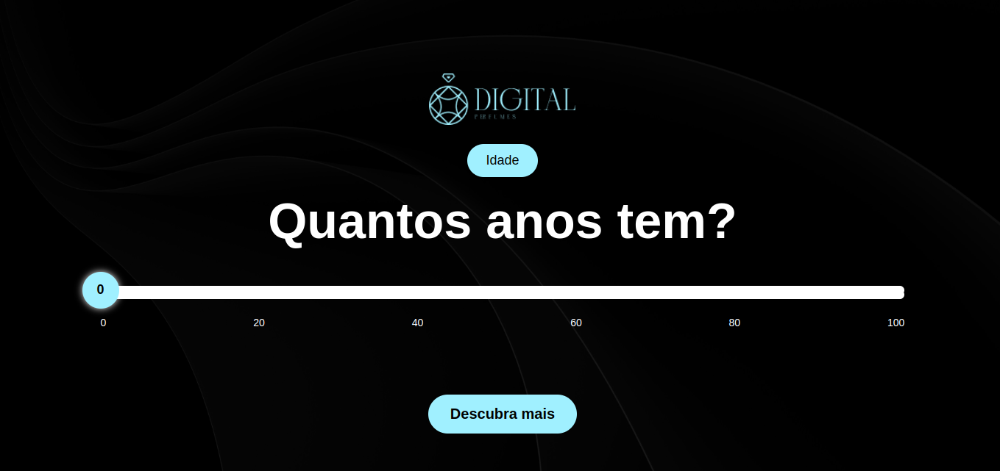

# ScentSelector

✨ Sobre o Projeto

Este é um quiz interativo desenvolvido para ajudar os usuários a descobrirem o perfume ideal de acordo com seu perfil e preferências. Através de uma sequência de perguntas, como idade, ocasião de uso, período do dia, clima, gênero, sentimento desejado e preferências de fragrâncias, o sistema analisa as respostas e recomenda o perfume perfeito.

🎯 Público-Alvo

Este projeto é voltado para amantes de perfumes e clientes em busca da fragrância perfeita, além de empresas e lojas que desejam personalizar a experiência de compra para seus clientes.
## Stack utilizada

**Front-end:** HTML5, CSS, JS


## Screenshots





## Uso/Exemplos

Git Clone
```shell
git clone https://github.com/Eduardochimchek/ScentSelector
```

Acessa Pasta
```shell
cd /caminho/ScentSelector
```

Abrir Pasta no VScode
```shell
code .
```

Para testar locamente abra no navegador o index html, utilizando Extensão do VsCode ou abrindo o próprio arquivo.